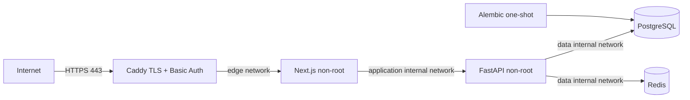

# Deployment architecture

Only Caddy publishes host ports. The application and data networks are Docker-internal. API and data services must not gain host port mappings. Caddy obtains/renews TLS after DNS is correct; the firewall permits 80/443 and operator-restricted SSH only.

## Host layout

- `/srv/pocket-alpha/repository`: immutable approved checkout.
- `/srv/pocket-alpha/secrets`: root-owned mode 700; all secret files root-owned mode 444. Compose mounts each file read-only only into its authorized service, avoiding image-specific UID assumptions.
- Docker named volumes: PostgreSQL, Redis AOF, Caddy certificates/config.
- `/srv/pocket-alpha/backups`: encrypted staging with short retention before off-server copy.
- Central log destination: receives stdout JSON without request bodies/tokens.

## Deployment sequence for later authorization

1. Confirm release SHA, green CI, clean checkout and image scan evidence.
2. Record `docker image inspect --format '{{json .RepoDigests}}'` for each image.
3. Verify DNS/firewall/NTP, free disk, backup target and alert receiver.
4. Create secrets and a strong Caddy password hash outside Git.
5. Export variables from an untracked owner-readable file or secret manager.
6. Run `docker compose -f compose.production.yaml config` and inspect that only proxy has ports.
7. Put the old frontend into maintenance mode if migrating retained data.
8. Create and verify a pre-migration PostgreSQL backup.
9. Build/pull the approved images, then run the one-shot migration.
10. Start the stack; require DB/Redis/API/web/proxy health and authentication smoke.
11. Verify logs contain no secret and both execution settings are false.
12. End maintenance mode and monitor error/latency/resource/backup signals.

## Rollback

Rollback application containers to the recorded previous SHA/digests. Database migrations are forward-fix by default; do not run destructive downgrades on retained data. If a migration must be reversed, stop writes, preserve a new failed-state backup, restore the pre-migration backup into a fresh volume, verify it, then switch the stack. Document RTO/RPO and the decision owner.

## Maintenance and disaster recovery

Use a temporary authenticated Caddy maintenance response while API/web are stopped. Preserve PostgreSQL and private journals before intervention. Disaster recovery provisions a clean host, restores secrets from the secret manager, restores PostgreSQL into a fresh volume, validates Alembic head and row/table counts, restores required private/research artifacts, starts Redis empty unless AOF is explicitly required, and then executes the smoke gate.

## Observability minimum

Ship JSON logs, retain correlation IDs, probe public authenticated frontend plus internal liveness/readiness, alert on 5xx/readiness, restart loops, CPU/memory/disk/inodes, PostgreSQL connection/storage, Redis memory/AOF, certificate expiry and backup age. Metrics/tracing/error reporting are future debt; external probes and log alerts are mandatory for this candidate.
